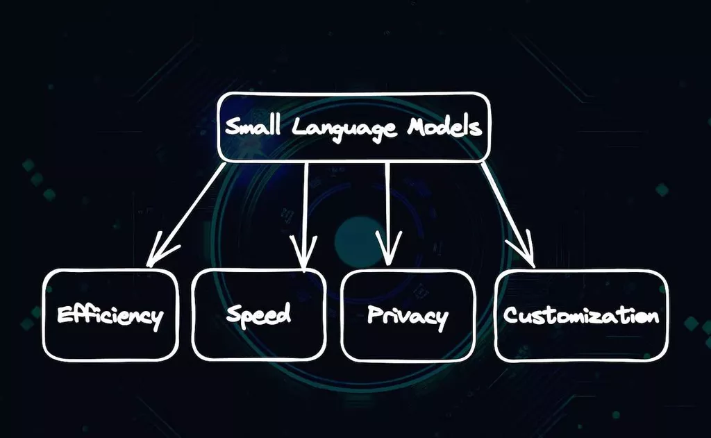

# Awesome-SLM 
Awesome-SLM: a curated list of Small Language Model

🔥 Small Language Models(SLM) Small language models are streamlined versions of large language models designed to retain much of the original capabilities while being more efficient and manageable. Here is a curated list of papers about small language models. 

## Table of Content

- [Awesome-SLM ](#awesome-slm-)
  - [Milestone Papers](#milestone-papers)
  - [Other Papers](#other-papers)
  - [SLM Leaderboard](#llm-leaderboard)
  - [Open SLM](#open-llm)
  - [SLM Data](#llm-data)
  - [SLM Evaluation](#llm-evaluation)
  - [Miscellaneous](#miscellaneous)

## Milestone Papers

|  Date  |       keywords       |    Institute    | Paper                                                                                                                                                                               | Publication |
| :-----: | :------------------: | :--------------: | :---------------------------------------------------------------------------------------------------------------------------------------------------------------------------------- | :---------: |
| 2017-06 |     Transformers     |      Google      | [Attention Is All You Need](https://arxiv.org/pdf/1706.03762.pdf)                                                                                                                      |   NeurIPS    |
| 2018-06 |       GPT 1.0       |      OpenAI      | [Improving Language Understanding by Generative Pre-Training](https://www.cs.ubc.ca/~amuham01/LING530/papers/radford2018improving.pdf)                                                 |            |
| 2018-10 |         BERT         |      Google      | [BERT: Pre-training of Deep Bidirectional Transformers for Language Understanding](https://aclanthology.org/N19-1423.pdf)                                                              |    NAACL      |
| 2019-10 |          T5          |      Google      | [Exploring the Limits of Transfer Learning with a Unified Text-to-Text Transformer](https://jmlr.org/papers/v21/20-074.html)                                                           |    JMLR     |
| 2020-01 |     Scaling Law     |      OpenAI      | [Scaling Laws for Neural Language Models](https://arxiv.org/pdf/2001.08361.pdf)                                                                                                        ||
| 2021-09 |         FLAN         |      Google      | [Finetuned Language Models are Zero-Shot Learners](https://openreview.net/forum?id=gEZrGCozdqR)                                                                                        |    ICLR  |
| 2021-10 |         T0         |      HuggingFace et al.      | [Multitask Prompted Training Enables Zero-Shot Task Generalization](https://arxiv.org/abs/2110.08207)                                                                                        |    ICLR  |
| 2022-01 |        LaMDA        |      Google      | [LaMDA: Language Models for Dialog Applications](https://arxiv.org/pdf/2201.08239.pdf)                                                                                                 ||
| 2022-06 |  Emergent Abilities  |      Google      | [Emergent Abilities of Large Language Models](https://openreview.net/pdf?id=yzkSU5zdwD)                                                                                                |    TMLR |
| 2023-02 | LLaMA|Meta|[LLaMA: Open and Efficient Foundation Language Models](https://research.facebook.com/publications/llama-open-and-efficient-foundation-language-models/)||
| 2023-07 | LLaMA 2 | Meta | [Llama 2: Open Foundation and Fine-Tuned Chat Models](https://arxiv.org/pdf/2307.09288.pdf) ||
|2023-10| Mistral 7B| Mistral |[Mistral 7B](https://arxiv.org/pdf/2310.06825.pdf)| |

## Other Papers
If you're interested in the field of SLM, you may find the above list of milestone papers helpful to explore its history and state-of-the-art. However, each direction of SLM offers a unique set of insights and contributions, which are essential to understanding the field as a whole. For a detailed list of papers in various subfields, please refer to the following link:

- [LLMDatahub](https://github.com/Zjh-819/LLMDataHub) - a curated collection of datasets specifically designed for chatbot training, including links, size, language, usage, and a brief description of each dataset

## SLM Leaderboard
- [Chatbot Arena Leaderboard](https://huggingface.co/spaces/lmsys/chatbot-arena-leaderboard) - a benchmark platform for large language models (LLMs) that features anonymous, randomized battles in a crowdsourced manner.
- [AlpacaEval Leaderboard](https://tatsu-lab.github.io/alpaca_eval/) - An Automatic Evaluator for Instruction-following Language Models 
 using Nous benchmark suite. 
- [Open LLM Leaderboard](https://huggingface.co/spaces/HuggingFaceH4/open_llm_leaderboard) - aims to track, rank and evaluate LLMs and chatbots as they are released.
- [OpenCompass 2.0 LLM Leaderboard](https://rank.opencompass.org.cn/leaderboard-llm-v2) - OpenCompass is an LLM evaluation platform, supporting a wide range of models (InternLM2,GPT-4,LLaMa2, Qwen,GLM, Claude, etc) over 100+ datasets.

## Open SLM
- Meta
  - [Llama 3-8|70B](https://llama.meta.com/llama3/)
  - [Llama 2-7|13|70B](https://llama.meta.com/llama2/)
  - [Llama 1-7|13|33|65B](https://ai.facebook.com/blog/large-language-model-llama-meta-ai/)
  - [OPT-1.3|6.7|13|30|66B](https://arxiv.org/abs/2205.01068)
- Mistral AI
  - [Mistral-7B](https://mistral.ai/news/announcing-mistral-7b/)
  - [Mixtral-8x7B](https://mistral.ai/news/mixtral-of-experts/)
  - [Mixtral-8x22B](https://mistral.ai/news/mixtral-8x22b/)
- Google
  - [Gemma-2|7B](https://blog.google/technology/developers/gemma-open-models/)
  - [RecurrentGemma-2B](https://github.com/google-deepmind/recurrentgemma)
  - [T5](https://arxiv.org/abs/1910.10683)
- Apple
  - [OpenELM-1.1|3B](https://huggingface.co/apple/OpenELM)
- Microsoft
  - [Phi1-1.3B](https://huggingface.co/microsoft/phi-1)
  - [Phi2-2.7B](https://huggingface.co/microsoft/phi-2)
  - [Phi3-3.8|7|14B](https://huggingface.co/microsoft/Phi-3-mini-4k-instruct)
- AllenAI
  - [OLMo-7B](https://huggingface.co/collections/allenai/olmo-suite-65aeaae8fe5b6b2122b46778)
- xAI
  - [Grok-1-314B-MoE](https://x.ai/blog/grok-os)
- Cohere
  - [Command R-35B](https://huggingface.co/CohereForAI/c4ai-command-r-v01)
- DeepSeek
  - [DeepSeek-Math-7B](https://huggingface.co/collections/deepseek-ai/deepseek-math-65f2962739da11599e441681)
  - [DeepSeek-Coder-1.3|6.7|7|33B](https://huggingface.co/collections/deepseek-ai/deepseek-coder-65f295d7d8a0a29fe39b4ec4)
  - [DeepSeek-VL-1.3|7B](https://huggingface.co/collections/deepseek-ai/deepseek-vl-65f295948133d9cf92b706d3)
  - [DeepSeek-MoE-16B](https://huggingface.co/collections/deepseek-ai/deepseek-moe-65f29679f5cf26fe063686bf)
  - [DeepSeek-v2-236B-MoE](https://arxiv.org/abs/2405.04434)
  - [DeepSeek-Coder-v2-16|236B-MOE](https://github.com/deepseek-ai/DeepSeek-Coder-V2)
- Alibaba
  - [Qwen-1.8|7|14|72B](https://huggingface.co/collections/Qwen/qwen-65c0e50c3f1ab89cb8704144)
  - [Qwen1.5-1.8|4|7|14|32|72|110B](https://huggingface.co/collections/Qwen/qwen15-65c0a2f577b1ecb76d786524)
  - [CodeQwen-7B](https://huggingface.co/Qwen/CodeQwen1.5-7B)
  - [Qwen-VL-7B](https://huggingface.co/Qwen/Qwen-VL)
  - [Qwen2-0.5|1.5|7|57-MOE|72B](https://qwenlm.github.io/blog/qwen2/)
- 01-ai
  - [Yi-34B](https://huggingface.co/collections/01-ai/yi-2023-11-663f3f19119ff712e176720f)
  - [Yi1.5-6|9|34B](https://huggingface.co/collections/01-ai/yi-15-2024-05-663f3ecab5f815a3eaca7ca8)
  - [Yi-VL-6B|34B](https://huggingface.co/collections/01-ai/yi-vl-663f557228538eae745769f3)
- Baichuan
  - [Baichuan-7|13B](https://huggingface.co/baichuan-inc)
  - [Baichuan2-7|13B](https://huggingface.co/baichuan-inc)
- Nvidia
  - [Nemotron-4-340B](https://huggingface.co/nvidia/Nemotron-4-340B-Instruct)
- BLOOM
  - [BLOOMZ&mT0](https://huggingface.co/bigscience/bloomz)
- Zhipu AI
  - [GLM-2|6|10|13|70B](https://huggingface.co/THUDM)
  - [CogVLM2-19B](https://huggingface.co/collections/THUDM/cogvlm2-6645f36a29948b67dc4eef75)
- OpenBMB
  - [MiniCPM-2B](https://huggingface.co/collections/openbmb/minicpm-2b-65d48bf958302b9fd25b698f)
  - [OmniLLM-12B](https://huggingface.co/openbmb/OmniLMM-12B)
  - [VisCPM-10B](https://huggingface.co/openbmb/VisCPM-Chat)
  - [CPM-Bee-1|2|5|10B](https://huggingface.co/collections/openbmb/cpm-bee-65d491cc84fc93350d789361)
- RWKV Foundation
  - [RWKV-v4|5|6](https://huggingface.co/RWKV)
- ElutherAI
  - [Pythia-1|1.4|2.8|6.9|12B](https://github.com/EleutherAI/pythia)
- Stability AI
  - [StableLM-3B](https://huggingface.co/collections/stabilityai/stable-lm-650852cfd55dd4e15cdcb30a)
  - [StableLM-v2-1.6|12B](https://huggingface.co/collections/stabilityai/stable-lm-650852cfd55dd4e15cdcb30a)
  - [StableCode-3B](https://huggingface.co/collections/stabilityai/stable-code-64f9dfb4ebc8a1be0a3f7650)
- BigCode
  - [StarCoder-1|3|7B](https://huggingface.co/collections/bigcode/%E2%AD%90-starcoder-64f9bd5740eb5daaeb81dbec)
  - [StarCoder2-3|7|15B](https://huggingface.co/collections/bigcode/starcoder2-65de6da6e87db3383572be1a)
- DataBricks
  - [MPT-7B](https://www.databricks.com/blog/mpt-7b)
- Shanghai AI Laboratory
  - [InternLM2-1.8|7|20B](https://huggingface.co/collections/internlm/internlm2-65b0ce04970888799707893c)
  - [InternLM-Math-7B|20B](https://huggingface.co/collections/internlm/internlm2-math-65b0ce88bf7d3327d0a5ad9f)
  - [InternLM-XComposer2-1.8|7B](https://huggingface.co/collections/internlm/internlm-xcomposer2-65b3706bf5d76208998e7477)
  - [InternVL-2|6|14|26](https://huggingface.co/collections/OpenGVLab/internvl-65b92d6be81c86166ca0dde4)

## SLM Data
- [LLMDataHub](https://github.com/Zjh-819/LLMDataHub)

## SLM Evaluation:
- [lm-evaluation-harness](https://github.com/EleutherAI/lm-evaluation-harness) - A framework for few-shot evaluation of language models.
- [lighteval](https://github.com/huggingface/lighteval) - a lightweight LLM evaluation suite that Hugging Face has been using internally.
- [OLMO-eval](https://github.com/allenai/OLMo-Eval) - a repository for evaluating open language models.
- [instruct-eval](https://github.com/declare-lab/instruct-eval) - This repository contains code to quantitatively evaluate instruction-tuned models such as Alpaca and Flan-T5 on held-out tasks.
- [simple-evals](https://github.com/openai/simple-evals) - Eval tools by OpenAI.
- [Giskard](https://github.com/Giskard-AI/giskard) - Testing & evaluation library for LLM applications, in particular RAGs
- [LangSmith](https://www.langchain.com/langsmith) - a unified platform from LangChain framework for: evaluation, collaboration HITL (Human In The Loop), logging and monitoring LLM applications.  
- [Ragas](https://github.com/explodinggradients/ragas) - a framework that helps you evaluate your Retrieval Augmented Generation (RAG) pipelines.

## Miscellaneous
This repo contains awesome LLM paper list and frameworks for LLM training, tools to deploy LLM, courses and tutorials about LLM and all publicly available LLM checkpoints and APIs. Since SLM shares many of the same issues as LLM, I recommend that you also look at content related to LLM.
- [Awesome-LLM](https://github.com/Hannibal046/Awesome-LLM)

## Contributing

This is an active repository and your contributions are always welcome!

I will keep some pull requests open if I'm not sure if they are awesome for LLM, you could vote for them by adding 👍 to them.

The template of this repo is based on the [Awesome-LLM](https://github.com/Hannibal046/Awesome-LLM) from @Hannibal046. 
---

If you have any question about this opinionated list, do not hesitate to contact me ro_keonwoo@korea.ac.kr.

[^1]: This is not legal advice. Please contact the original authors of the models for more information.